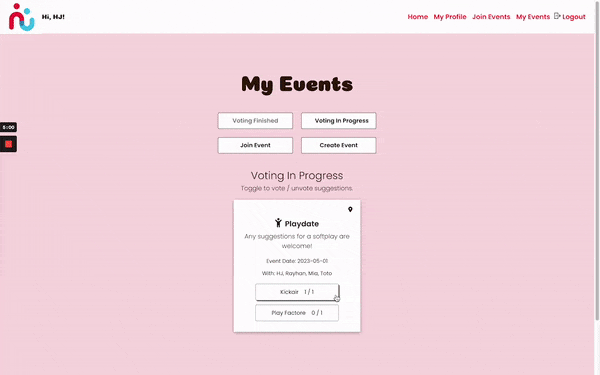
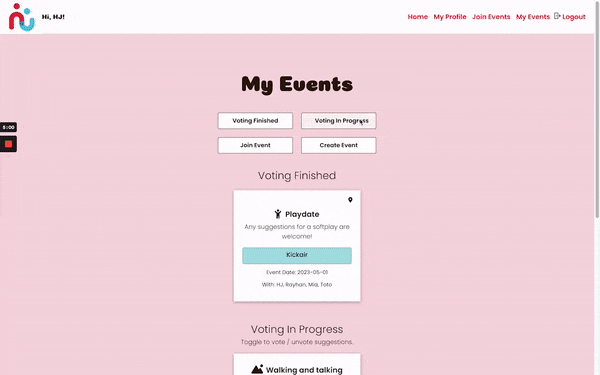
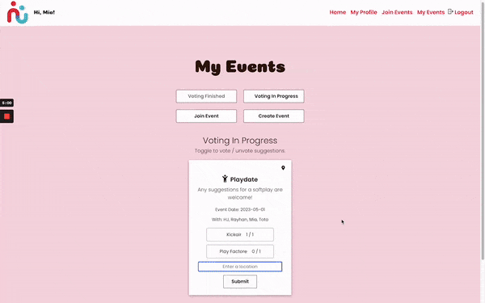

# 

<!-- ## Table of contents

- [Introduction](#introduction)
- [Concepts covered](#concepts-covered)
- [Setup & getting started](#setup-&-getting-started)
- [Using the app](#using-the-app)
- [Author](#author) -->

## Introduction

Welcome to huddleUp! This is an app for organising meet-ups created by using React, ExpressJS and PosgreSQL.
Originally created by [HJ](https://github.com/cocomarine) and [Rayhan](https://github.com/RayBeera) as part of the Command Shift bootcamp course [(backend repo)](https://github.com/cocomarine/huddle-up-backend), this repo contains the latest updates. 

## Overivew
huddleUp is a web application that allows users to join and create events so that others can join, make suggestions and/or cast votes for suggestions. The frontend is built with React, and communicates with the backend via REST APIs.

## Using the app
To sign up, simply provide your email, name, and password. When creating an event, you can add details such as the title, date, description, participants, and category. The app will generate a unique invite code that you can share with others to join your event.

Once participants have joined, they can start suggesting places and casting votes for their favorite suggestions. As you type in a place name, our app will suggest predicted names and addresses to choose from. Participants can submit their suggestions and see them appear on the event card in the My Events page. To vote, users can click on each suggestion to toggle between voted and unvoted states. Each suggestion will show how many votes it has received so far.

Suggested places can be viewed on a map with a list of suggestions and addresses. 

Once all the participants have finished voting, the event card will be marked as 'Voting Finished' and the most voted suggestion will be displayed.  

## Concepts covered
- Interpreting user stories and translating into app features
- React.js for building user interfaces
- React Router for handling client-side routing
- Custome React hooks to create state in components and configure how they are updated
- React context to share data with several child components 
- Axios for making HTTP requests to a REST API and error handling
- Event handling
- Handling authentication tokens
- React Testing Library (RTL) to test UI 
- Using Google Maps JavaScript API, Places API and Geocoding API

## Getting started
To run the application locally, follow these steps:

1. Clone this repository: git clone https://github.com/cocomarine/huddle-up-frontend.git
2. Install the dependencies: npm install
3. Start the application: npm start
4. The application should now be running at http://localhost:3000.

## Configuration
The frontend requires a backend API to communicate with, such as this [(huddleUp backend repo)](https://github.com/cocomarine/huddle-up-backend). By default, it assumes that the backend API is running at http://localhost:4000.
Using Google Autocomplete and Map features requires Google Maps API key.

## Furture work
- Improving UI
- Adding admin role for managing events
- Adding other types of suggestions such as dates and times
- Notification feature
- More testing to be done